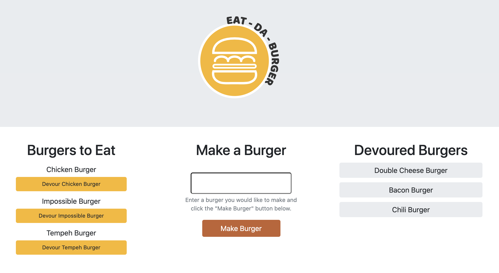

# Eat Da Burger

## Table of Contents
- [Description](#Description)
- [Installation](#Installation)
- [Deployed](#Deployed)
- [Questions](#Questions)

### Description

Eat Da Burger is an application that creates a devours burgers - using MySQL, Node, Express, Handlebars and a homemade ORM. Eat Da Burger follows the MVC design pattern, uses Node and MySQL to query and route data, and Handlebars to generate its HTML content.

- Users are able to "make" and "devour" different types of burgers by entering the burger they would like to make and clicking the "Make Burger" button.

- Created burgers are listed on the left side of the application and feature a "devour" button.

- Clicking the "devour" button relocates the burger to the list of devoured burgers on the right side of the application.

### Installation

Use the package manager [node](https://www.npmjs.com/) to run Eat Da Burger.

The application will be invoked with the following comands:

    npm install
    node index.js

### Deployed

Eat Da Burger is deployed  [here](https://sheltered-sands-52662.herokuapp.com/) on Heroku.

### Questions

Employee Tracker was created by [aflavors](https://github.com/aflavors).

If you have any questions, please contact me at akeemflavors@gmail.com. 
